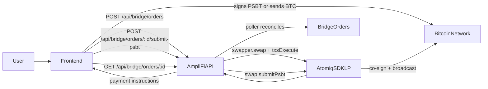

# Bridge Flow (BTC -> Starknet)

This document explains how AmpliFi bridge order creation and Bitcoin payment execution work, with emphasis on Option A (wallet data provided at order creation).

## Overview



At a high level, backend creates and stores the Atomiq swap context, frontend executes the payment step, and the backend recovery poller reconciles final status.

## AmpliFi vs onesat

| Area | AmpliFi | onesat |
| --- | --- | --- |
| Swap creation | Backend via `POST /api/bridge/orders` | Frontend via SDK `swapper.swap(...)` |
| Payment handling | Frontend uses `payment` from API response | Frontend calls `swap.sendBitcoinTransaction(wallet)` |
| PSBT return type | `FUNDED_PSBT` with Option A, else `RAW_PSBT` | Usually funded directly by SDK in frontend flow |
| PSBT submission | Frontend sends signed PSBT to backend endpoint | SDK submits directly with `swap.submitPsbt(...)` internally |

## Payment Types Returned by API

`POST /api/bridge/orders` returns `data.payment` and `data.quote.bitcoinPayment`.

### `ADDRESS`

- Contains `address`, `amountSats`, optional `hyperlink`.
- Frontend instructs user or wallet to send exact sats to the address.
- No PSBT submission endpoint is required for this path.

### `FUNDED_PSBT`

- Contains `psbtHex` or `psbtBase64` and `signInputs`.
- Frontend signs only the listed `signInputs`.
- Frontend submits signed PSBT to `POST /api/bridge/orders/:id/submit-psbt`.

### `RAW_PSBT`

- Contains raw PSBT and `in1sequence`.
- Frontend must fund the transaction inputs and preserve required sequence semantics from Atomiq docs.
- Frontend signs and submits signed PSBT via `POST /api/bridge/orders/:id/submit-psbt`.

## Option A: FUNDED_PSBT Flow

Option A means the frontend includes wallet identity in create-order payload:

- `bitcoinPaymentAddress`
- `bitcoinPublicKey`

When both are provided, backend calls Atomiq `txsExecute({ bitcoinWallet: { address, publicKey } })`, allowing Atomiq to return `FUNDED_PSBT`.

### Sequence

1. Frontend calls `POST /api/bridge/orders` with:
   - `sourceAsset`, `destinationAsset`, `amount`, `amountType`, `receiveAddress`, `walletAddress`
   - `bitcoinPaymentAddress`, `bitcoinPublicKey` (both required together for Option A)
2. Backend creates swap and returns `payment.type = "FUNDED_PSBT"` (when LP supports this path).
3. Frontend signs PSBT with wallet and sends signed payload to:
   - `POST /api/bridge/orders/:id/submit-psbt`
4. Backend calls `swap.submitPsbt(signedPsbt)`.
5. LP co-signs and broadcasts BTC tx.
6. Recovery poller moves order through status updates until settled or refunded.

## Fallback Behavior

If `bitcoinPaymentAddress` and `bitcoinPublicKey` are not supplied, backend requests execution actions without wallet context and may return `RAW_PSBT` (or address payment instructions depending on LP/swap type).

## Wallet Signing Interface

Wallet integrations should support PSBT signing in a way compatible with Atomiq action payloads, for example:

```ts
signPsbt(
  psbtToSign: { psbt: Transaction; psbtHex: string; psbtBase64: string },
  signInputs: number[]
): Promise<Transaction | string>;
```

Returned value can be a signed PSBT object or encoded PSBT string, which is then submitted to backend.

## Recovery and Status Reconciliation

Backend poller:

- polls Atomiq swap state,
- auto-claims when swap is claimable,
- auto-refunds when swap is refundable,
- persists state changes in bridge order/event/action tables.

Frontend should poll `GET /api/bridge/orders/:id` for status updates after payment execution.
